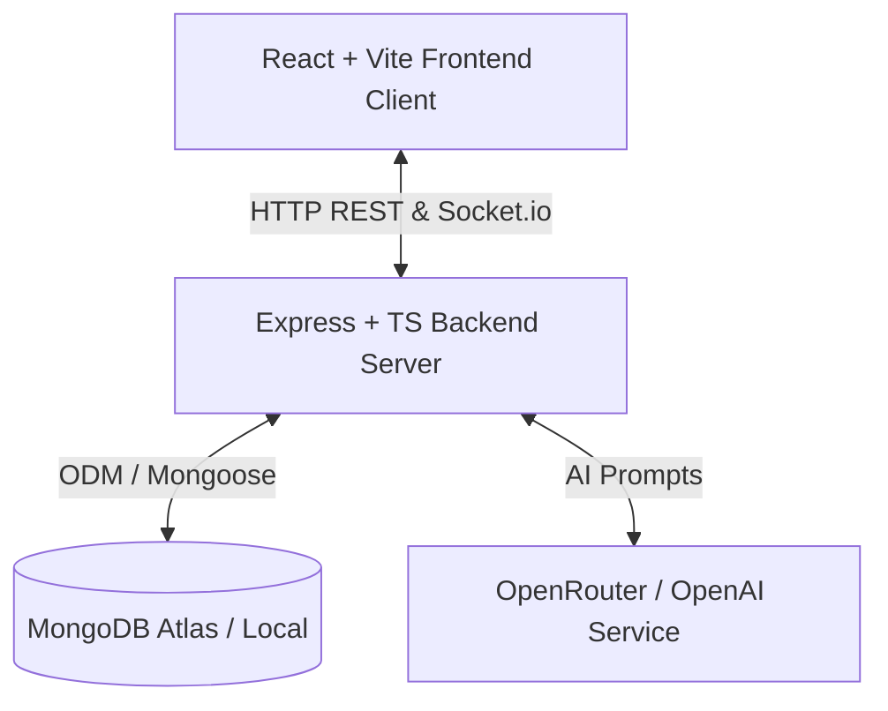

# 🚀 Talent-AI — Premium AI-Powered Recruitment Platform

[](https://nodejs.org/)
[](https://www.typescriptlang.org/)
[](https://react.dev/)
[](https://www.mongodb.com/)
[](https://socket.io/)

Talent-AI is a state-of-the-art, fully responsive recruitment and job discovery platform that bridges the gap between candidates and recruiters using advanced AI. Candidates can upload resumes, get them instantly parsed and analyzed by AI, match with highly compatible jobs, and interact in real-time. Recruiters can post jobs, manage candidate pipelines, and review AI-driven suitability scores.

---

## 🏗️ Architecture & Core Stack

The system is built as a monorepo containing a separate frontend client and backend server:



### **Frontend Client**
* **Framework:** React + Vite (Fast building and HMR)
* **Styling:** Tailwind CSS v4 + Material UI (MUI) Icons
* **Real-time:** Socket.io-client for instantaneous chat messages and notifications
* **Routing:** React Router v7

### **Backend Server**
* **Runtime:** Node.js with TypeScript (`ts-node`)
* **API Framework:** Express
* **Database Engine:** MongoDB with Mongoose ODM
* **AI Engine:** OpenRouter API Integration for resume parsing and job compatibility matching
* **Real-time Engine:** Socket.io (with rooms corresponding to active users)
* **File Processing:** PDF Parsing (`pdf-parse`) and Multipart File Uploads (`multer`)

---

## 📂 Project Structure

```text
Talent-AI/
├── frontend/               # React client application
│   ├── src/
│   │   ├── components/    # Reusable UI components
│   │   ├── infrastructure/# API Clients, routing, hooks, contexts
│   │   └── pages/         # Dashboard, Job Discovery, Profile, Auth Pages
│   └── package.json
│
└── backend/                # TypeScript Node/Express backend server
    ├── src/
    │   ├── adapters/       # Controllers, Express Routes, DB Schemas & Repositories
    │   ├── domain/         # Use Cases, Services, Models (Clean Architecture)
    │   ├── index.ts        # Server entry point
    │   └── clear_db.ts     # Reusable Database Cleanup tool
    ├── .env                # Environment configuration
    └── package.json
```

---

## ⚙️ Setup & Installation

### Prerequisite Checklist
* **Node.js** (v18 or higher recommended)
* **MongoDB** (Local instance running, or a MongoDB Atlas cloud connection string)

---

### **1. Backend Server Setup**

1. Navigate to the `backend` folder:
   ```bash
   cd backend
   ```
2. Install dependencies:
   ```bash
   npm install
   ```
3. Create a `.env` file in the `backend` directory and configure the environment variables:
   ```env
   PORT=5001
   MONGO_URI=mongodb://127.0.0.1:27017/talentai
   # OR use your MongoDB Atlas URI:
   # MONGO_URI=mongodb+srv://<user>:<password>@cluster0...mongodb.net/talentai
   
   JWT_SECRET=your_jwt_signing_key_here
   JWT_EXPIRES_IN=7d
   
   OPENROUTER_API_KEY=your_openrouter_api_key
   YOUR_SITE_URL=http://localhost:5173
   ```
4. Start the server in Development Mode (with hot reloading):
   ```bash
   npm run dev
   ```

---

### **2. Frontend Client Setup**

1. Open a new terminal and navigate to the `frontend` folder:
   ```bash
   cd frontend
   ```
2. Install dependencies:
   ```bash
   npm install
   ```
3. Start the Vite development server:
   ```bash
   npm run dev
   ```
4. Open the app in your browser at `http://localhost:5173`.

---

## 🧹 Database Management Commands

To make development and testing friction-free, we've included an automated script to reset active database collections. This is helpful when testing new application setups or seeding fresh datasets.

### Clear Current Jobs & Related Data
To wipe all jobs, job applications, real-time messages, system notifications, and reset user saved-jobs/candidate counters:

1. Navigate to the `backend` folder:
   ```bash
   cd backend
   ```
2. Run the cleanup script:
   ```bash
   npm run db:clear
   ```

*The script will automatically target the current active database defined in your `MONGO_URI` environment variable, disconnect safely, and output a detailed breakdown of cleared items.*

---

## 💡 Git & Development Workflow

To stage, commit, and push your development changes to GitHub:

```bash
# 1. Check changed files
git status

# 2. Stage all your changes
git add .

# 3. Commit with standard commit messages
git commit -m "feat: implement database cleaning utilities and documentation"

# 4. Push to remote main branch
git push origin main
```

---

🚀 *Built with passion by the Talent-AI team.*
